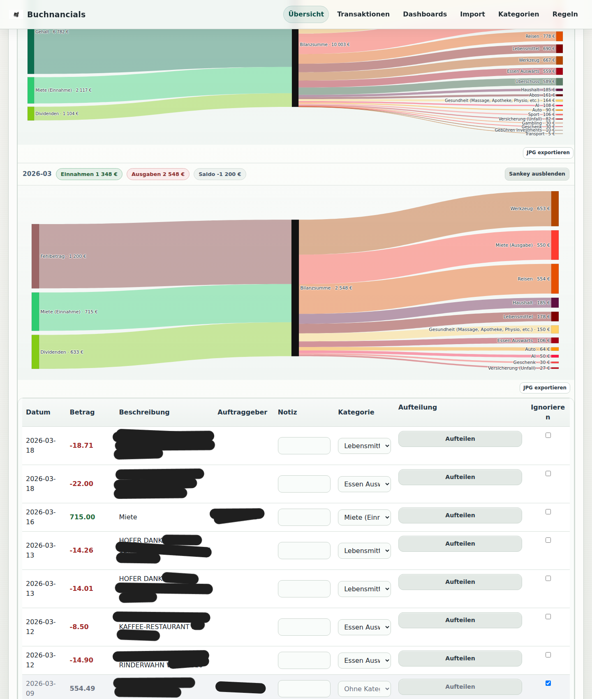
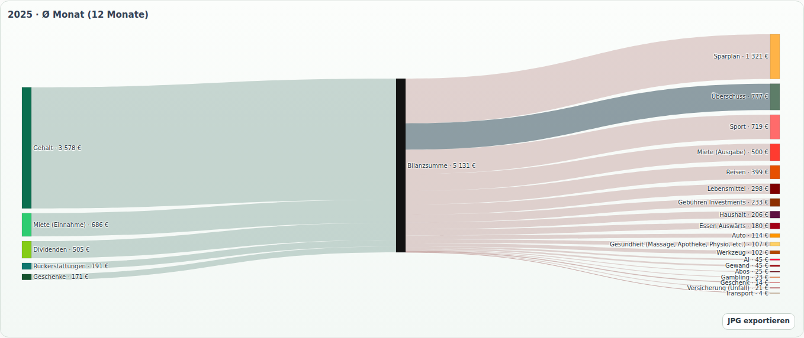

# Buchnancials

Buchnancials is my local-first cash flow tracker.

I built it for myself because I wanted a simple way to import bank CSVs, clean up transactions, apply categorization rules, and get useful monthly, quarterly, and yearly views without putting financial data into a cloud service.

The UI is mostly in German because this is a personal project first.

## What It Does

- imports CSV exports from my bank
- lets me map columns before import
- detects duplicates during import
- stores transactions locally in SQLite
- supports manual categorization, notes, and split transactions
- supports ignore flags for full transactions or individual split lines
- applies rule-based categorization
- shows rollups on year / quarter / month level
- includes dashboard views and Sankey diagrams for cash flow analysis
- supports local snapshot export/import

## Screenshots

These screenshots are from my local setup and are mainly here to show the UI and general workflow.

### Overview



### 2025 Average Month Sankey



## Quick Start

1. Install dependencies:

```bash
uv sync
```

2. Start the app:

```bash
uv run uvicorn app.main:app --reload
```

3. Open it in the browser:

```text
http://127.0.0.1:8000
```

## How I Use It

1. Go to **Import** and upload a CSV export.
2. Check the suggested column mapping.
3. Import the transactions.
4. Review duplicates and imported rows.
5. Categorize transactions manually where needed.
6. Create or adjust rules in **Regeln** so the next import needs less manual work.
7. Use **Übersicht** and **Dashboards** for rollups and trends.
8. Use snapshot export/import for local backups or moving the data to another machine.

## Data And Privacy

Everything is stored locally.

- `data/app.db` contains the main SQLite database
- `data/imports/` stores imported CSV copies
- `data/backups/` stores automatic backups, for example before snapshot import

There is no cloud sync in this project.

## Stack

- FastAPI
- Jinja2 templates
- Vanilla JavaScript
- Plotly
- SQLite

## Development

Run the test suite:

```bash
uv run pytest
```

Run a quick compile sanity check:

```bash
uv run python -m compileall app tests
```

## License

GPL-3.0. See [LICENSE](LICENSE).
